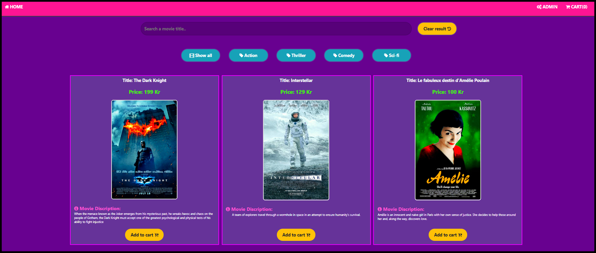

## Webshop Aplication with REACT: CLASSES & HOOKS.

The application acts as a webshop. Present products, make order, delete order & check-out.

The webshop gets the products dynamically from an API then present the products. Customer can make an Orders, delete order & check-out.

**Contains the following fucntions: cart, search panel & categories.**

